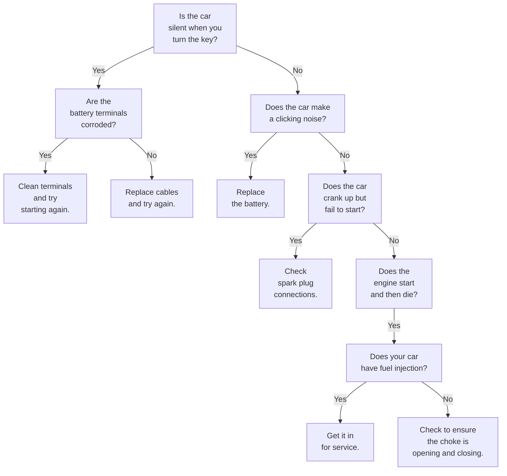

# Troubleshooting flow chart

```mermaid
flowchart TD;
    A[Is the car \n silent when you \n  turn the key?]-->|Yes|B
    B[Are the \n battery terminals \n corroded?]-->|Yes|D
    B-->|No|E
    D[Clean terminals \n and try \n starting again.]
    E[Replace cables \n and try again.]
    A-->|No|C
    C[Does the car make \n a clicking noise?]-->|Yes|F
    C-->|No|G
    F[Replace \n the battery.]
    G[Does the car \n crank up but \n fail to start?]-->|Yes|H
    G-->|No|I
    H[Check \n spark plug \n  connections.]
    I[Does the \n engine start \n and then die?]-->|Yes|J
    J[Does your car \n have fuel injection?]-->|Yes|K
    J-->|No|L
    K[Get it in \n for service.]
    L[Check to ensure \n the choke is \n opening and closing.]
```