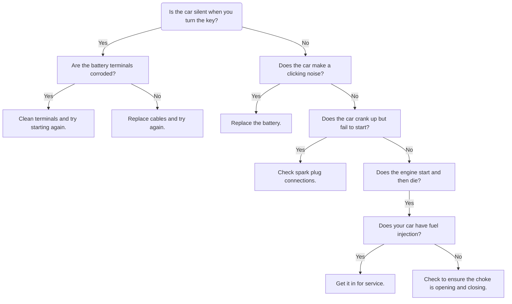

# Troubleshooting flow chart

```mermaid
flowchart TD;
    A(Is the car silent when you turn the key?)-->|Yes|B
    B[Are the battery terminals corroded?]-->|Yes|D
    B-->|No|E
    D[Clean terminals and try starting again.]
    E[Replace cables and try again.]
    A-->|No|C
    C[Does the car make a clicking noise?]-->|Yes|F
    C-->|No|G
    F[Replace the battery.]
    G[Does the car crank up but fail to start?]-->|Yes|H
    G-->|No|I
    H[Check spark plug connections.]
    I[Does the engine start and then die?]-->|Yes|J
    J[Does your car have fuel injection?]-->|Yes|K
    J-->|No|L
    K[Get it in for service.]
    L[Check to ensure the choke is opening and closing.]
```